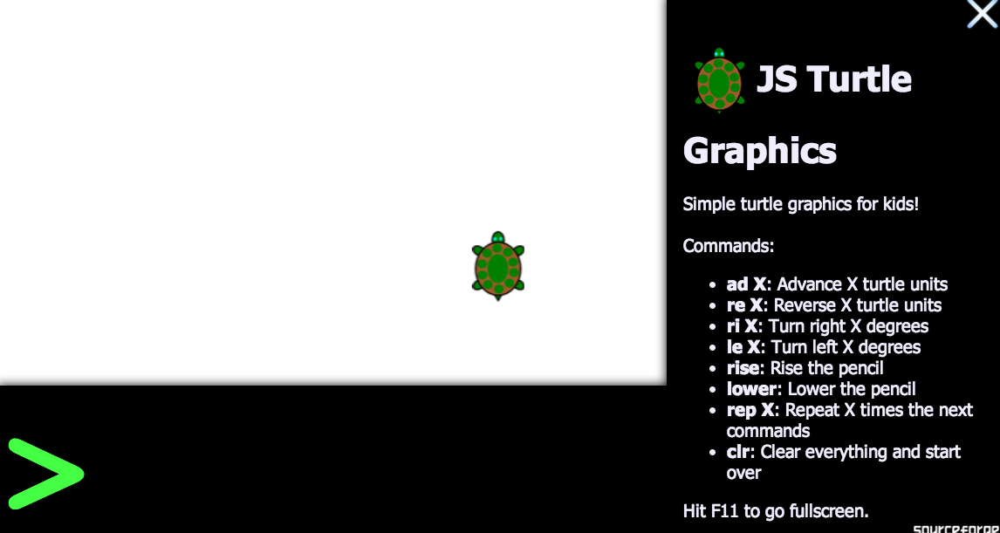
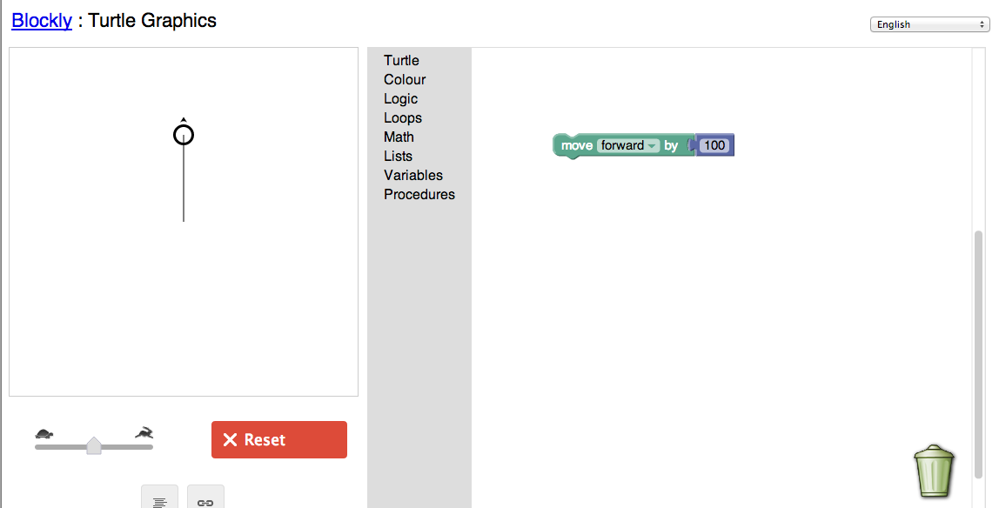

Turtle Graphics for older students
====================

Work with the younger K-4 students by mapping out challenges and helping to explain the process of making the turtle move.  Provide advanced examples of shapes (stars and circles).  Student's teaching something helps them learn.

### Games to play for this exercise
1.  **Ordered Logic Game**
  Travis will serve as the "object" to move around the room.

  - High five three people (one by the interior door, one by the books, one by the exterior door)
  - Everyone else is a data taker (printable data logs)
  - Efficiency comparison:
      * Front door - back to center, books - back to center, back door - back to center VS.
      * Front door - books - back door - back to center

  Can they give chained commands with success?

2.  **Repeating Game**
  Student will serve again as the object.
  - Tell them how to make a square the old way (advance, right 90, advance, right 90, advance, right 90, advance)
  - Tell them to make a square the new way ( repeat 4 times, advance and right 90 )

## [Turtle Lesson Seqence Plan for Students](turtle_lesson_sequence.md) - Given to older students

### [Turtle Graphics](http://jsturtlegraphic.sourceforge.net/)
Interactive first glance at Turtle Graphics

Blockly Turtle Graphics
### [Blockly Turtle Graphics](https://blockly-demo.appspot.com/static/apps/turtle/index.html)

